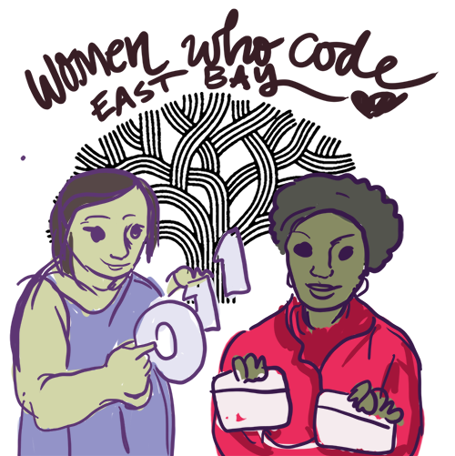

# east-bay-ideas

# Sections

- [Group Projects](projects/README.md)
- [Learning](learning/README.md)
- [Misc](misc/README.md) did you know that Oakland is Javascript city? Did you know that SimCity was created in Emeryville and Walnut Creek?

## Datasets

There are all sorts of Oakland and East Bay releated data sets to play with, many using the [SODA Developers API](http://dev.socrata.com) 

- [data.open.oakland.org](http://data.openoakland.org)
- City of Oakland Data [link](https://data.oaklandnet.com)
	- Crimewatch Map the past 90 days [link](https://data.oaklandnet.com/Public-Safety/CrimeWatch-Maps-Past-90-Days/ym6k-rx7a)
	- See Click Fix - Public Works requests [link](https://data.oaklandnet.com/Infrastructure/Service-requests-received-by-Public-Works-through-/quth-gb8e)
	- Map of Head Start Locations [link](https://data.oaklandnet.com/Education/Map-of-Head-Start-Locations/hqcd-z3hu) 

## Brainstorming

Our collective ideas about what the East Bay chapter should do in 2015.

- Code Review 
- Learning
- Debugging, Unit Testing
- Interviewing Skills: Algorithms
- Frameworks and Libraries: D3, MVC, Angular, MEAN Stack
- Overview of software/web development careers: DevOps, QA, Development, More
- Game Development

